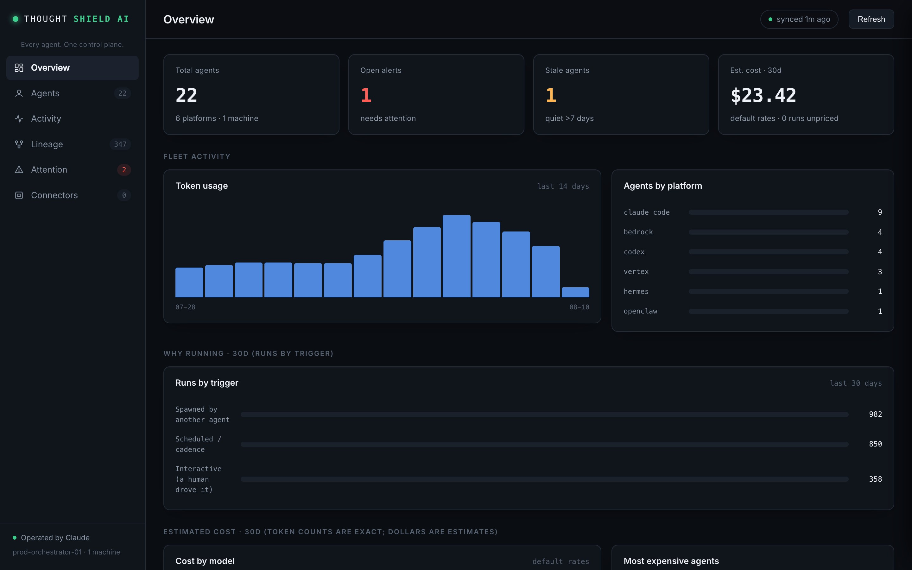
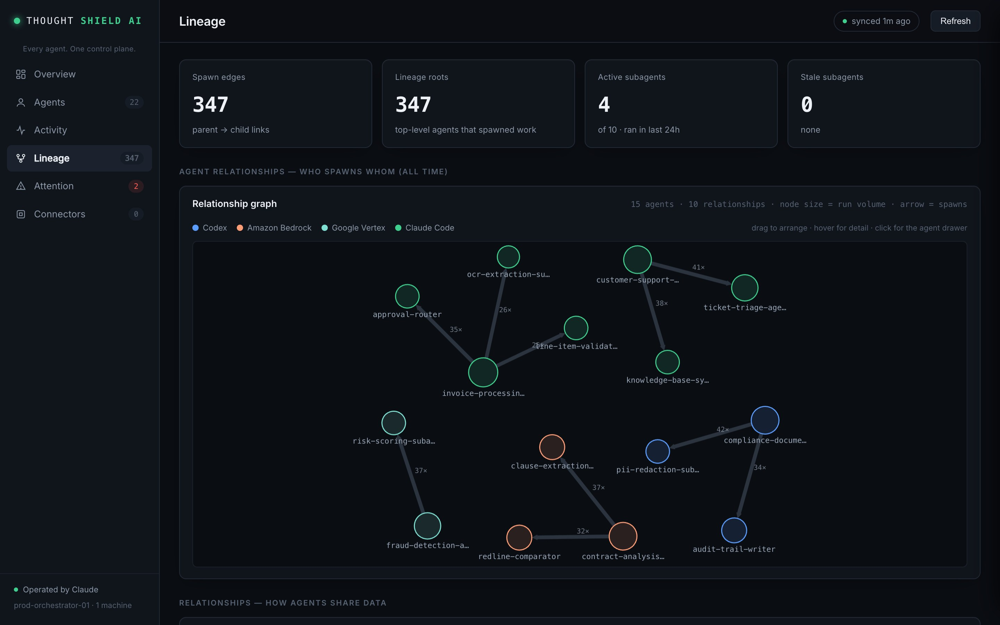

# AnveInspect

[](https://github.com/ANVEAI/anveinspect/actions/workflows/ci.yml)
[](LICENSE)
[](package.json)
[](CONTRIBUTING.md)

**See every AI agent you run — what it costs, who spawned what, and get paged
when one silently stops.**

The open-source core powering **[ThoughtShieldAI](https://thoughtshieldai.com)** —
the AI control plane for enterprise Agentic AI. Everything in this repo is real,
shipped, and MIT-licensed; nothing here is a mockup.

Teams now run dozens of coding agents across Claude Code, Codex, OpenClaw,
Hermes, and their clouds — and nobody can answer "what's running, why, and what
did it cost?" AnveInspect answers it with **zero instrumentation**: it reads the
logs your agents already write and reuses the platform CLIs you're already
signed into. One dashboard, one CLI, and an MCP server so Claude itself can
operate the fleet.

<p align="center">
  
  
</p>
<p align="center"><sub>Sample fleet shown — illustrative data, not a real customer's.</sub></p>

```bash
git clone <repo> && cd anveinspect && npm install   # npm publish pending — then just: npx anveinspect
npx anveinspect doctor       # detects platforms, reuses your CLI logins, first scan
npx anveinspect dash         # the fleet, live at localhost:4177
```

30 seconds from install to a full inventory — no API keys pasted, no SDK added
to your agents, no code changed.

```
platform CLIs (gcloud/aws/wrangler/az)  ─┐
claude/codex/openclaw/hermes local logs ─┼─▶ collector ─▶ SQLite ─┬─▶ CLI
claude hooks ─▶ fleet-emit ─▶ spool ─────┘                        ├─▶ MCP (Claude operates it)
                                                                  ├─▶ dashboard (:4177)
                                          cadence engine ─▶ alerts ┴─▶ Slack / macOS (the pager)
```

## Connect your AI tools (bindings)

One command prints the exact registration for each tool, resolving your install's paths:

```bash
anveinspect setup claude    # Claude Code: plugin dir or `claude mcp add` one-liner
anveinspect setup codex     # Codex: ~/.codex/config.toml block
anveinspect setup cursor    # Cursor: .cursor/mcp.json block
```

`doctor` reuses the sessions you already have — `gcloud auth login`, `aws configure`,
`wrangler login`, `az login` — so cloud platforms connect with **no API keys to paste**.
Anything not signed in prints the exact one-line command to fix it. Example:

```
✓ Claude Code            reads ~/.claude/projects (no signin needed)
✓ Codex                  reads ~/.codex/sessions (no signin needed)
✓ Google Vertex          gcloud authed, project my-proj
→ Cloudflare Workers     wrangler present but not logged in
      sign in:  wrangler login
```

Then:

```bash
anveinspect status      # fleet pulse + open alerts + stale agents
anveinspect report      # full AI-ready briefing
anveinspect dash        # dashboard at http://localhost:4177
```

## Operated by Claude (the primary interface)

Install the plugin (`claude --plugin-dir packages/plugin`) and any Claude session
becomes your fleet operator. Ask it: *"connect my platforms"* → `/anveinspect:setup`;
*"how's my fleet?"* → a full briefing; *"watch my nightly agent, it runs at 3am"* →
it declares the cadence and the next silent failure pages you.

- **16 MCP tools** — `fleet_setup`, `fleet_status`, `fleet_attention`, `fleet_agents`,
  `fleet_agent_detail`, `fleet_scan`, `fleet_declare_cadence`, `fleet_check`,
  `fleet_ack`, `fleet_report`, `fleet_insights`, `fleet_lineage`, `fleet_analytics`,
  `fleet_tag`, `fleet_connectors_sync`, `fleet_connectors_status` — zod-validated,
  structured output, read-only annotations.
- **Skill** `fleet-ops` + slash commands `/anveinspect:setup`, `:status`, `:scan`,
  `:attention`, `:watch`, `:brief`.
- **Hooks** capture live run events for crash detection and trigger classification.

## Dashboard (enterprise control plane)

Six views (`npm run dash` → http://localhost:4177):

- **Overview** — KPIs (agents, alerts, stale, tokens, est. cost), token-usage trend,
  agents-by-platform, estimated-cost breakdown (by model + most-expensive agents),
  activity-by-hour, top consumers.
- **Agents** — full inventory: live search, vendor/status filters, sortable columns,
  inline tag chips; click any row for the **detail drawer** (runs, cadence, token
  sparkline, run-history timeline, tag editor).
- **Activity** — live chronological feed of runs across every platform.
- **Lineage** — the **agent relationship graph** (interactive force layout: who
  spawns whom across all executions, node size = run volume, edge weight + arrow =
  spawn direction and count, drag/hover/click-through) plus the spawn-tree explorer
  for single executions (click a root to expand, with subtree tokens and descendant
  counts).
- **Attention** — open alerts (with Ack) + stale agents.
- **Connectors** — per-platform plug-and-play health.

## Insights & cost

`anveinspect insights` (analytics JSON), `anveinspect costs` (estimated 30-day spend
by model / agent, busiest hours, failure bursts). Cost estimates come from an editable
`~/.anveinspect/pricing.json`; **token counts are exact, dollars are estimates**, and
every result reports priced/unpriced/tokenless coverage.

## Control

`anveinspect tag add|remove|list <agent> <tag>` — organize the fleet with local
tags/groups (cohort, tier, owner, "retire"). Purely local metadata: never touches a
platform or changes agent behavior.

## Silent-failure alerting (the wedge)

Declare when an agent *should* run and get paged when it doesn't:

```bash
anveinspect cadence declare zapmind-autopilot "daily 03:00" --grace 60
anveinspect check              # evaluate now
anveinspect schedule install   # launchd job every 15 min: scan → check → deliver
```

Cadence grammar: `daily HH:MM` · `weekdays HH:MM` · `weekly mon HH:MM` · `every Nh`.
Declared cadences page; inferred ones only suggest. Token spikes fire at >3× the
trailing median. Alerts dedup per window (ack once, never re-fire), deliver exactly
once, and retry on failure. Paging works **out of the box**: with no Slack webhook
configured, alerts land in macOS Notification Center; add
`{"slackWebhookUrl":"https://hooks.slack.com/..."}` to `~/.anveinspect/notify.json`
to page Slack instead.

## All commands

| Command | What it does |
|---|---|
| `doctor` / `init` | Detect platforms, reuse CLI logins, first scan + sync |
| `setup <claude\|codex\|cursor>` | Print the exact MCP/plugin binding for that tool |
| `dash [port]` | Serve the dashboard (default http://localhost:4177) |
| `scan` | Ingest local Claude Code + Codex history (idempotent) |
| `status` | Fleet pulse, open alerts, stale agents |
| `agents` | Full inventory |
| `agent <name>` | One agent: runs, cadence, subagent spawns |
| `report` | AI-ready markdown briefing (pulse, trend, economics, coverage) |
| `insights` | Structured analytics (JSON) |
| `check` | Evaluate cadences + token spikes, persist alerts |
| `cadence declare <agent> "<expect>"` | Declare an expected schedule |
| `ack <id>` | Acknowledge an alert |
| `tick` | scan → check → deliver (the scheduled entrypoint) |
| `notify deliver` | Push open alerts to Slack now |
| `schedule install\|status\|uninstall` | launchd standing watch |
| `connectors sync\|status\|init\|set` | Platform connectors |

Add `--json` to any command for machine-readable output.

## Architecture

Monorepo (`packages/*`): `schema` (vendor-neutral types + SQLite DDL + fingerprinting),
`collector` (scanners, cadence engine, connectors, onboarding, CLI), `adapters`
(isomorphic platform connectors — pure fetch, no vendor SDKs, so the same code runs
locally and in Workers later), `mcp` (stdio server), `plugin` (Claude Code plugin).
One shared query layer feeds CLI, MCP, and dashboard — identical numbers everywhere.

## Design principles (verified in code + tests)

- **Read-only + catalog-only** for cloud connectors: least-privilege scopes, never a
  mutating call, credentials stay client-side (`~/.anveinspect/connectors.json`, 0600)
  and never touch the fleet database.
- **Honest data**: token counts unavailable ≠ zero; inferred values are labeled and
  never page; dollar figures are never invented.
- **Never break the watchdog**: transcripts deleted mid-scan, corrupt lines, and
  degraded rescans all fail safe without losing data or crashing the tick.

## Development

```bash
npm install
npm test          # unit, e2e, fuzz, scale, adapters, cadence/DST, dashboard — see the CI badge above
npm run typecheck # 0 errors
npm run dash      # dashboard at http://localhost:4177
```

CI (GitHub Actions) runs typecheck + tests + an MCP handshake on every push.
See [CONTRIBUTING.md](CONTRIBUTING.md) for the project layout and the three
non-negotiables (never break the watchdog, honest data only, read-only outward).

## Known constraints

- Token/cost data comes from local transcripts (undocumented format); the collector
  degrades gracefully across version drift.
- Cloud connectors are catalog-only in v1 (inventory + metadata staleness, not
  per-run telemetry — that lives in each cloud's monitoring stack).
- Standing watch installs a macOS launchd job; on Linux, `schedule install` prints a
  ready-to-paste cron line for the same `tick` (scan → check → deliver) instead.

## Contributing & security

Contributions welcome — start with [CONTRIBUTING.md](CONTRIBUTING.md). Please report
security issues privately per [SECURITY.md](SECURITY.md), never in a public issue.
By participating you agree to the [Code of Conduct](CODE_OF_CONDUCT.md).

## License

[MIT](LICENSE) © ANVEAI

MIT licensed.
